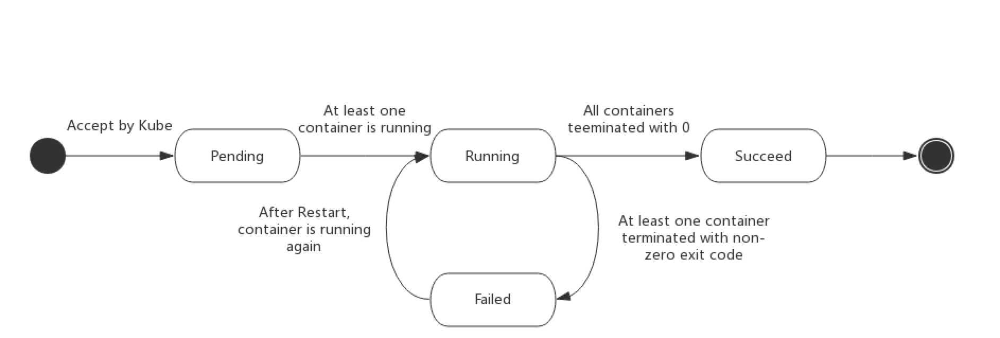

# Kubernetes学习笔记

标签：Kubernetes 学习笔记

## 来源

* 《Kubernetes权威指南》-电子工业出版社
* [Kubernetes handBook中第3篇，概念与原理](https://jimmysong.io/kubernetes-handbook/concepts/)

## Kubernetes架构

### 组件介绍

#### Master

Master节点上面主要由四个模块组成：APIServer、scheduler、controller manager、etcd

* APIServer:APIServer负责对外提供RESTful的Kubernetes API服务，它是系统管理指令的统一入口，任何对资源进行增删改查的操作都要交给APIServer处理后再提交给etcd。如架构图中所示，kubectl（Kubernetes提供的客户端工具，该工具内部就是对Kubernetes API的调用）是直接和APIServer交互的。
* schedule:scheduler的职责很明确，就是负责调度pod到合适的Node上。如果把scheduler看成一个黑匣子，那么它的输入是pod和由多个Node组成的列表，输出是Pod和一个Node的绑定，即将这个pod部署到这个Node上。Kubernetes目前提供了调度算法，但是同样也保留了接口，用户可以根据自己的需求定义自己的调度算法。
* controller manager:如果说APIServer做的是“前台”的工作的话，那controller manager就是负责“后台”的。每个资源一般都对应有一个控制器，而controller manager就是负责管理这些控制器的。比如我们通过APIServer创建一个pod，当这个pod创建成功后，APIServer的任务就算完成了。而后面保证Pod的状态始终和我们预期的一样的重任就由controller manager去保证了。
* etcd:etcd是一个高可用的键值存储系统，Kubernetes使用它来存储各个资源的状态，从而实现了Restful的API。

#### Node

每个Node节点主要由三个模块组成：kubelet、kube-proxy、runtime。

* runtime指的是容器运行环境，目前Kubernetes支持docker和rkt两种容器。
* kube-proxy:该模块实现了Kubernetes中的服务发现和反向代理功能。反向代理方面：kube-proxy支持TCP和UDP连接转发，默认基于Round Robin算法将客户端流量转发到与service对应的一组后端pod。服务发现方面，kube-proxy使用etcd的watch机制，监控集群中service和endpoint对象数据的动态变化，并且维护一个service到endpoint的映射关系，从而保证了后端pod的IP变化不会对访问者造成影响。另外kube-proxy还支持session affinity。
* kubelet:Kubelet是Master在每个Node节点上面的agent，是Node节点上面最重要的模块，它负责维护和管理该Node上面的所有容器，但是如果容器不是通过Kubernetes创建的，它并不会管理。本质上，它负责使Pod得运行状态与期望的状态一致。

#### Pod

Pod是k8s进行资源调度的最小单位，每个Pod中运行着一个或多个密切相关的业务容器，这些业务容器共享这个Pause容器的IP和Volume，我们以这个不易死亡的Pause容器作为Pod的根容器，以它的状态表示整个容器组的状态。一个Pod一旦被创建就会放到Etcd中存储，然后由Master调度到一个Node绑定，由这个Node上的Kubelet进行实例化。

每个Pod会被分配一个单独的Pod IP，Pod IP + ContainerPort 组成了一个Endpoint。

#### Service

Service其功能使应用暴露，Pods 是有生命周期的，也有独立的 IP 地址，随着 Pods 的创建与销毁，一个必不可少的工作就是保证各个应用能够感知这种变化。这就要提到 Service 了，Service 是 YAML 或 JSON 定义的由 Pods 通过某种策略的逻辑组合。更重要的是，Pods 的独立 IP 需要通过 Service 暴露到网络中

### 概述

Kubernetes的来源：Borg的一个开源版本，google久负盛名的一个内部使用的大规模集群管理系统。基于容器技术，目的是实现资源管理的自动化，以及跨多个数据中心的资源利用率的最大化。

它是一个开放的语言，无论是java、Go、C++还是用Python编写的服务，都可以毫无困难地映射为Kubernetes的Service，并通过标准的TCP通信协议进行交互。

核心组件：

* etcd保存了整个集群的状态（key-value型的数据库）
* apiserver提供了资源操作的唯一入口
* controller manager负责维护集群的状态，比如故障检测、自动扩展、滚动更新等。
* scheduler负责资源的调度，按照预先的调度策略将Pod调度到相应的机器上。
* kubelet负责维护容器的生命周期，同时也负责Volume(CSI)和网络（CNI）的管理
* Container runtime负责镜像管理以及容器的真正运行
* kube-proxy负责为Service提供cluster内部的服务发现和负载均衡。

比较简洁的图

master架构

node架构

kubernetes的设计理念和功能是一个类似于linux的分层架构，如下图所示

* 核心层(nucleus)：Kubernetes最核心的功能，对外提供API构建高层应用，对内提供插件式应用执行环境。
* 应用层：部署（无状态应用、有状态应用、批处理任务、集群应用等）和路由（服务发现、DNS解析等）、Service Mash（部分位于应用层）
* 管理层：系统度量（如基础设施、容量和网络的度量），自动化（如自动扩展、动态Provision等）以及策略管理（RBAC、Quota、PSP、NetworkPolicy等）、Service Mesh（部分位于管理层）
* 接口层：kubectl命令行工具、客户端SDK以及集群联邦
* 生态系统：在接口层之上的庞大容器集群管理调度的生态系统，可以分为两个范畴。在kubernetes外部是日志、监控、配置管理、CI/CD、WorkFlow、Faas、OTS应用、ChatOps、GitOps、SecOps等。在Kubernetes内部是CRI、CNI、CSI、镜像仓库、Cloud Provider、集群自身的配置和管理等。

### 设计理念

架构上同上，是一个与linux类似的分层结构。

#### API设计原则

Kubernetes系统API的设计有以下几条原则：

1. 所有API应该是声明式的。相对于命令式操作，对于重复操作的效果更加稳定。可以在隐藏细节的同时保留系统未来持续优化的可能性。隐含了所有API对象都是名词性质的，描述了一个用户期望所得到的一个目标分布式对象。
2. API对象是彼此互补而且可组合的。鼓励API对象尽量实现面向对象设计的要求，“高内聚，松耦合”。
3. 高层API以操作意图为基础设计。高层设计一定是从业务出发，而不是过早的从技术实现出发。因此，针对Kubernetes的高层API设计，一定是以Kubernetes的业务为基础出发，也就是以系统调度管理容器的操作意图为基础设计。
4. 低层API根据高层API的控制需要设计。设计实现低层API的目的，是为了被高层API使用，考虑减少冗余、提高重用性的目的，低层API的设计也要以需求为基础，要尽量抵抗受技术实现影响的诱惑。
5. 尽量避免简单封装，不要有在外部API无法显式知道的内部隐藏机制。简单的封装，实际没有提供新的功能，反而增加了对所封装API的依赖性。内部隐藏的机制也不利于系统维护的设计方式。
6. API的操作复杂度与对象数量成正比。从系统性能角度出发，要保证整个系统随着系统规模的扩大，性能不会迅速变慢到无法使用。操作复杂度不能超过O（n）
7. API对象状态不能依赖于网络连接状态。分布式环境下，网络连接断开是经常发生的事情，因此要保证API对象能够应对网络的不稳定。
8. 尽量避免让操作机制依赖于全局状态，因为在分布式环境下要保持全局状态的同步是非常困难的。

#### 控制机制设计原则

1. 控制逻辑应该只依赖于当前状态。为了保证分布式系统的稳定可靠，只依赖于当前状态，可以比较容易将暂时出现故障的系统恢复到正常状态。
2. 假设任何错误地可能，并做容错处理。依靠自己实现的代码不会出错来保证系统稳定本身是难以实现的，因为可能会有系统甚至物理层面的故障，因此要设计对任何可能错误的容错处理。
3. 尽量避免复杂状态机，控制逻辑不要依赖无法监控的内部状态。
4. 假设任何操作都可能被操作对象拒绝，甚至被错误解析。
5. 每个模块都可以在出错后自我恢复。
6. 每个模块都可以在必要时优雅地降级服务。

## Kubernetes的核心技术概念和API对象

API对象是Kubernetes集群中的管理操作单元。

每个API对象有3大类属性：元数据metadata、规范spec和状态status。元数据是用来标识API对象的，每个对象至少有3个元数据：namespace、name和uid。除此之外还有各种各样的labels用来标识和匹配不同的对象。规范描述了用户期望Kubernetes集群中的分布式系统达到的理想状态。状态描述了系统实际当前达到的状态。

Kubernetes中的所有配置都是通过API对象的spec去设置的，即用户通过配置系统的理想状态来改变系统。

### 一些概念（来自于Kubernetes权威指南）

在Kubernetes中，Service(服务)是分布式集群架构的核心，一个Service对象用于如下关键特征。

* 拥有一个唯一指定的名字
* 拥有一个虚拟IP和端口号
* 能够提供某种远程服务能力
* 被映射到了提供这种服务能力的一组容器应用上。

容器提供了强大的隔离功能，所以有必要把为Service提供服务的这组进程放入容器中进行隔离。为此，Kubernetes设计了Pod对象，将每个服务进程包装到相应的Pod中，使其成为Pod中运行的一个容器。为了建立Service和Pod间的关联关系，Kubernetes首先个每个Pod贴上标签，然后给相应的Service定义标签选择器(Label Selector)，从而解决两者的关联问题。

#### Pod

Pod是Kubernetes集群中运行部署应用或服务的最小单元，可以支持多容器。设计理念是支持多个容器在一个Pod中共享网络地址和文件系统，可以通过进程间通信和文件共享这两种简单高效的方式组合完成任务。

Pod是Kubernetes集群中所有业务的基础，可以看作运行在Kubernetes集群中的小机器人。

权威指南的描述：

* Pod运行在我们称之为节点(Node)的环境中。这个节点既可以是物理机，也可以是私有云或者公有云中的一个虚拟机，通常在一个节点上运行几百个Pod；
* 其次，每个Pod里运行着一个特殊的被称为Pause的容器，其他容器被称为业务容器，这些业务容器共享Pause容器的网络栈和Volume挂载卷，因此它们之间的通信和数据交换更为高效，在设计的时候可以充分利用这一特性将一组密切相关的服务进程放入同一个Pod中。
* 最后，需要注意的，并不是每个Pod和里面运行的容器都能“映射”到一个Service上，只有那些提供服务(无论是对外还是对内)的一组Pod才会被映射成一个服务。

#### 副本控制器

副本控制器，Replication Controller，RC

RC会通过监控运行中的Pod来保证集群中运行指定数目的Pod副本。少于指定数目，RC会启动运行新的Pod副本；多于指定数目，RC就会杀死多余的Pod副本。RC是较早期的技术概念，只适用于长期伺服型的业务类型。

#### 副本集

Replica Set,RS

RS是新一代的RC，提供同样的高可用能力。一般不单独使用，而是作为Deployment的理想状态参数使用。

#### 部署(Deployment)

对应无状态应用

部署，deployment,表示用户对Kubernetes集群的一次更新操作。它是比RS应用模式更广的API对象，可以创建、更新一个新的服务，或是滚动升级一个服务（创建一个新的RS，然后逐渐将新RS中的副本数增加到理想状态，将旧RS中的副本数减少到0的复合操作）从发展方向上来说，未来对所有长期伺服型的业务的管理，都会通过Deployment来进行。

#### 服务(Service)

相当于一组Pod的逻辑集合

如何访问服务：一个Pod只是一个运行服务的实例，随时可能在一个节点上停止，在另一个节点上以一个新的IP启动一个新的Pod，因此不能以确定的IP和端口号来提供服务。

要稳定地提供服务需要服务发现和负载均衡能力。

服务发现完成的工作，是针对客户端访问的服务，找到对应的后端服务实例。在K8集群中，客户端需要访问的服务就是Service对象。每个Service会对应一个集群内部有效的虚拟IP，集群内部通过虚拟IP来访问一个服务。

在Kubernetes集群中，微服务的负载均衡是由kube-proxy来实现的。Kube-proxy就是Kubernetes集群内部的负载均衡器。它是一个分布式代理服务器，在Kubernetes的每个节点上都有一个。伸缩性优势：需要访问服务的节点越多，提供负载均衡能力的kube-proxy就越多，高可用节点就越多。如果是与平时一样在服务器端做反向代理来进行负载均衡，还要进一步解决反向代理的负载均衡和高可用问题。

#### 任务(Job)

Job是Kubernetes用来控制批处理型任务的API对象。批处理型业务和长期伺服型业务的主要区别是批处理业务的运行有头有尾，而长期伺服型业务在用户不停止的情况下永远运行。Job管理的Pod根据用户的设置把任务成功完成后就自动退出了，这个成功完成的标志根据不同的spec.completions策略而不同。单Pod型任务，一个Pod成功就标志着完成；定数成功型任务要保证有N个任务全部成功；工作队列型任务根据应用确认的全局成功而标志成功。

#### 后台支撑服务集（DaemonSet）

后台支撑型服务的核心关注点在于Kubernetes集群中的节点，要保证每个节点都有某个类型业务的Pod在运行。节点可以是所有的集群节点，也可以是通过nodeSelector选定的一些特定节点。

#### 有状态服务集（StatefulSet）

对应有状态应用。

在云原生应用的体系里，有下列两组近义词：第一组是无状态stateless、牲畜cattle、无名nameless、可丢弃disposable；第二组是有状态stateful、宠物pet、有名having name、不可丢弃non-disposable。

RC和RS主要是控制无状态服务，其所控制的Pod的名字是随机设置的，一个Pod出故障了就被丢弃掉，在另一个地方重新启动新的Pod。重要的是总数。其Pod一般不挂载存储或者挂载共享存储，保存的是所有Pod的共享状态（像牲畜一样，没有人性特征）。

StatefulSet是用来控制有状态服务，每个Pod的名字都是事先确定的。Pod的名字，用于关联该Pod对应的状态。StatefulSet中的每个Pod会挂载自己独立的存储，如果有一个Pod出现故障，会从其他节点启动一个同样名字的Pod，挂上原来Pod的存储来继续以它的状态提供服务。

#### 集群联邦（federation）

在云计算环境中，服务的作用距离从近到远一般有：同主机（Host,Node）、跨主机同可用区(Available Zone)、跨可用区同地区(Region)、跨地区同服务商（Cloud Service Provider）、跨云平台。Kubernetes的设计定位是单一集群在同一个地域内，这样网络性能才能够满足Kubernetes的调度和计算存储的连接要求。

联合集群服务是为了提供跨region跨服务商的Kubernetes集群服务而设计的。

每个Kubernetes Federation有自己的分布式存储、API Server和Controller Manager，用户可以通过Federation的API Server注册该Federation的成员Kubernetes Cluster。这样通过这个API Server创建、更改对象时，Federation会在所有注册的子Kubernetes Cluster上都会创建一份对应的API对象。在提供业务请求服务的时候，Kubernetes Federation会先在自己的各个子cluster之前进行负载均衡。

#### 存储卷(Volume)

Kubernetes集群中的存储卷与docker中的存储卷类似，不同的是docker存储卷作用范围为一个容器，Kubernetes存储卷的生命周期和作用范围是一个Pod。每个Pod中的存储卷是由Pod中所有容器所共享的。

#### 持久存储卷(Persistent Volume,PV)和持久存储卷声明（Persistent Volume Claim,PVC）

PV和PVC使得Kubernetes集群有了存储的逻辑抽象能力，使得在配置Pod的逻辑黎可以忽略对实际后台存储技术的配置，而把这项配置的工作交给PV的配置者，即集群的管理者。

存储的PV和PVC的这种关系，跟计算的Node和Pod的关系是非常类似的。PV和Node是资源的提供者，根据集群的基础设施变化而变化，由Kubernetes集群管理员配置；PVC和Pod是资源的使用者，根据业务需求的变化而变化，由Kubernetes的使用者即服务的管理员来配置。

#### 节点(Node)

Kubernetes集群中的计算能力由Node提供，最初Node称为服务节点Minion，等同于Mesos集群中的Slave节点，是所有Pod运行所在的工作主机。Node可以是物理机或是虚拟机。

工作主机的统一特征是上面要运行kubelet管理节点上运行的容器。

#### 密钥对象(Secret)

Secret用来保存和传递密码、密钥、认证凭证等敏感信息的对象。使用Secret的好处是可以避免把敏感信息明文写在配置文件中。

将登陆、认证的信息存入一个Secret对象中，在配置文件中通过这个Secret对象引用这些敏感信息，好处是：意图明确、避免重复，减少暴露机会。

#### 用户账户User Account和服务账户Service Account

用户账户为人提供账户标识，服务账户为计算机进程和Kubernetes集群中运行的Pod提供账户标识。

用户账户和服务账户的一个区别是作用范围；用户账户对应的是人的身份，是跨namespace的；服务账户对应的是一个运行中的程序的身份，与特定的namespace是相关的。

#### 命名空间(namespace)

命名空间为kubernetes集群提供虚拟的隔离作用。

#### RBAC访问授权

Role-based Access Control，基于角色的访问控制。相对于基于属性的访问控制(Attribute-based Access Control,ABAC)，RBAC主要是引入了角色Role和角色绑定RoleBinding的抽象概念。

ABAC中，Kubernetes集群中的访问策略只能跟用户直接关联；而在RBAC中，访问策略可以跟某个角色关联，具体的用户在跟一个或多个角色相关联。

#### 集群管理

在集群管理方面，Kubernetes将集群中的机器划分为一个Master节点和一群工作节点（Node）。

在Master节点上运行着集群管理相关的一组进程kube-apiserver、kube-controller-manager和kube-scheduler，这些进程实现了整个集群的资源管理、Pod调度、弹性伸缩、安全控制、系统监控和纠错等管理功能，并且都是全自动完成的。

Node作为集群中的工作节点，运行真正的应用程序，在Node上Kubernetes管理的最小运行单元是Pod。Node上运行着Kubernetes的kubelet、kube-proxy服务进程，这些服务进程负责Pod的创建、启动、监控、重启、销毁，以及实现软件模式的负载均衡器

### etcd

etcd是kubernetes集群中的重要组件，用于保存集群所有的网络配置和对象的状态信息。

需要用到etcd的两个服务：

* 网络插件flannel、对于其他网络插件也需要用到etcd存储网络的配置信息。
* kubernetes本身，包括各种对象的状态和元信息配置。

#### 原理

etcd使用的raft一致性算法来实现的，是一款分布式一致性KV存储，主要用于共享配置和服务发现。

[raft一致性算法](http://thesecretlivesofdata.com/raft/)

[etcd架构与实现解析](http://jolestar.com/etcd-architecture/)

#### 作用

etcd提供可靠的共享存储来同步信息。

1. 提供存储以及获取数据的接口，它通过协议保证 Etcd 集群中的多个节点数据的强一致性。用于存储元信息以及共享配置。
2. 提供监听机制，客户端可以监听某个key或者某些key的变更（v2和v3的机制不同，参看后面文章）。用于监听和推送变更。
3. 提供key的过期以及续约机制，客户端通过定时刷新来实现续约（v2和v3的实现机制也不一样）。用于集群监控以及服务注册发现。
4. 提供原子的CAS（Compare-and-Swap）和 CAD（Compare-and-Delete）支持（v2通过接口参数实现，v3通过批量事务实现）。用于分布式锁以及leader选举。

### 开放接口

为了便于系统的扩展，Kubernetes开放以下的接口，分别对接不同的后端，来实现自己的业务逻辑：

* CRI(Container Runtime Interface)：容器运行时接口，提供计算资源
* CNI(Container Network Interface)：容器网络接口，提供网络资源
* CSI(Container Storage Interface)：容器存储接口，提供存储资源

#### CRI

CRI中定义了容器和镜像的服务接口。使用protocol buffer，基于gRPC。

container runtime实现了CRI gRPC Server，包括RuntimeService和ImageService。该gRPC Server需要监听本地的Unix socket，而kubelet则作为gRPC Client运行

#### CNI 

CNI是CNCF旗下的一个项目，由一组用于配置linux容器的网络接口的规范和库组成，同时还包含了一些插件。CNI仅关心容器创建时的网络分配，和当容器被删除时释放网络资源。

#### CSI 

CSI代表容器存储接口。试图建立一个行业标准接口的规范，借助CSI容器编排系统CO可以将任意存储系统暴露给自己的容器工作负载。

CSI卷类型是一种out-tree（即跟其他存储插件在同一代码路径下，随着kubernetes的代码同时编译的）的CSI卷插件，用于Pod和同一节点上运行的外部CSI卷驱动程序交互。部署CSI兼容卷驱动后，用户可以使用csi作为卷类型来挂载驱动提供的存储。

### 扩容

在Kubernetes集群中，你只需要为扩容的Service关联的Pod创建一个Replication Controller(简称RC)，就可以完成扩容。

一个RC定义文件中包含以下3个关键信息：

* 目标Pod的定义。
* 目标Pod需要运行的副本数量（Replicas）
* 要监控的目标Pod的标签(label)

在创建好RC后，Kubernetes会通过RC中定义的Label筛选出对应的Pod实例并实时监控其状态和数量。如果实例数量少于定义的副本数量，则会根据RC中定义的Pod模板创建一个新的Pod，然后将此Pod调度到合适的Node上启动运行，直到Pod实例的数量达到预定目标。

### 微服务与Kubernetes

微服务架构的核心是将一个巨大的单体应用分解为很多小的互相连接的微服务，一个微服务背后可能有多个实例副本在支撑，副本的数量可能会随着系统的负荷变化而进行调整，内嵌的负载均衡器在这里发挥了重要作用。

微服务的这种架构使得每个服务都可以由专门的开发团队来开发，开发者可以自由选择开发技术。而且由于每个微服务独立开发、升级、扩展，因此系统具备很高的稳定性和快速迭代进化能力。

#### Master

Master，指集群控制节点。每个Kubernetes集群里需要有一个Master节点来负责整个集群的管理和控制。

Master节点上运行着一组关键进程：

* Kubernetes API Server：提供了HTTP Rest接口的关键服务进程，是Kubernetes里所有资源的增、删、改、查等操作的唯一入口，也是集群控制的入口进程
* Kubernetes Controller Manager，Kubernetes里所有资源对象的自动化控制中心，可以理解为资源对象的大总管。
* Kubernetes Scheduler，负责资源调度(Pod调度)的过程，相当于公交公司的调度室

Master节点往往还启动了一个etcd Server进程，因为Kubernetes里的所有资源对象的数据全部是保存在etcd中的。

#### Node

除了Master，Kubernetes集群中的其他及其被称为Node节点，或是Minion。Node节点才是Kubernetes中的工作负载节点，每个Node会被Master分配一些工作负载（Docker容器）。

每个Node节点上运行着以下一组关键进程：

* kubelet：负责Pod对应的容器的创建、启停等任务，同时与Master节点密切协作，实现集群管理的基本功能。
* kube-proxy：实现Kubernetes Service的通信与负载均衡机制的重要组件。
* Docker Engine(docker)：Docker引擎，负责本机的容器创建和管理工作。

Node节点可以在运行时动态添加到Kubernetes集群中，只要它正确安装并配置和启动了上述关键进程，在默认情况下kubelet会向master注册自己。一旦Node被纳入集群管理范围，kubelet进程会定时向Master节点汇报自身的情报，例如操作系统、Docker版本、机器的CPU和内存情况，以及哪些Pod在运行等。方便Master统计资源使用情况，以及进行高效均衡的资源调度策略。

当某个Node超过指定时间不上报信息时，会被Master判定为“失联”，Node的状态被标记为不可用，随后Master触发“工作负载大转移”的自动流程。

## Kubernetes中的网络

Kubernetes中的网络要解决的核心问题是每台主机的IP地址网段划分，以及单个容器的IP地址分配。概括为：

* 保证每个Pod拥有一个集群内唯一的IP地址。
* 保证不同节点的IP地址划分不会重复。
* 保证跨节点的Pod可以相互通信。
* 保证不同节点的Pod可以与跨节点的主机相互通信。

Kubernetes通过插件来解决容器的联网，只要实现了官方设计的CNI，就可以自己设计网络插件。

## 资源对象与基本概念解析

对象：Kubernetes对象是持久化的条目，Kubernetes使用这些条目去表示整个集群的状态。特别地，它们描述了如下的信息：

* 什么容器化应用在运行。
* 可以被应用使用的资源
* 关于应用如何表现的策略，比如重启策略、升级策略，以及容错策略。

Kubernetes对象是“目标性记录”，即一旦创建对象，Kubernetes系统将持续工作以确保对象存在。通过创建对象，可以有效地告知Kubernetes系统，所需要的集群工作负载看起来是什么样子，这就是Kubernetes集群的期望状态。

对Kubernetes对象进行操作，需要适用Kubernets API。当使用kubectl命令行接口时，比如CLI会使用必要的Kubernetes API调用，也可以在程序中直接使用Kubernetes API。

### 对象Spec与状态

每个Kubernetes对象包含两个嵌套的对象字段，负责管理对象的配置：对象spec和对象status。spec必须提供，表示期望状态。status描述实际状态。Kubernetes控制平面一直处于活跃状态，管理着对象的实际状态以与我们所期望的状态相匹配。

### 描述Kubernetes对象

创建Kubernetes对象时必须提供对象的spec，用来描述该对象的期望状态，以及关于对象的一些基本信息。当使用API的时候，必须在请求体中包含JSON格式的信息。更常用的式，需要在.yaml文件中为kubectl提供这些信息。

## Pod状态与生命周期管理

### 概览

Pod代表着集群中运行的进程，里面封装着应用的容器，是部署的一个单位。

Pod的两种使用方式：

* 一个Pod中运行着一个容器。“每个Pod中一个容器”的模式是最常用的模式；在这种使用方式中，你可以把Pod想象成单个容器的封装，kubernetes管理的是Pod而不是直接管理容器。
* 在一个Pod中同时运行多个容器。一个Pod中也可以同时封装几个需要紧密耦合相互协作的容器，它们之间共享资源。这些在同一个Pod中的容器可以互相协作成一个service单位——一个容器共享文件，另一个“sidecar”容器更新这些文件。Pod将这些容器的存储资源作为一个实体来管理。

#### Pod中如何管理多个容器

Pod中可以同时运行多个进程（作为容器）协同工作。同一个Pod中的容器会自动分配到同一个Node上，共享资源、网络环境和依赖，且总是被同时调度。

这是一种比较高级的做法，只有当你的容器需要紧密配合协作的时候才需要去考虑。

##### 网络

每个Pod都会被分配唯一的IP地址，Pod中所有容器共享网络空间，包括IP地址和端口。Pod内部的容器可以使用localhost相互通信。Pod中的容器与外界通信时，必须分配共享网络资源。

##### 存储

可以为一个Pod指定多个共享的volume，Pod中所有的容器都可以访问共享的volume。volume也可以用来持久化Pod中的存储资源，以防止容器重启后文件丢失。

#### 使用Pod

一般不会单独创建Pod，而是使用更高级的称为Controller的抽象层来进行管理。特点：生命周期短，用后即焚。Pod被创建后会被调度到Node上，直到进程终止、被删掉、因为缺少资源而驱逐、或者Node故障。

PS：Pod只是提供容器的运行环境并保持容器的运行状态，重启容器并不会造成Pod重启。

Pod不会自愈。如果Pod运行的Node有故障，或是调度器本身故障，那么这个Pod会被删除。如果Pod所在的Node缺少资源或者Pod处于维护状态，Pod也会被驱逐。

#### Pod和Controller

Controller可以创建和管理多个Pod，提供副本管理、滚动升级和集群级别的自愈能力。例子：Deployment、StatefulSet、DaemonSet。

#### Pod Templates

Pod模板是包含了其他Object的Pod定义，Controller根据Pod模板来创建实际的pod。

### Pod解析

就像每个应用容器，pod被认为是临时（非持久的）实体。在Pod的生命周期中讨论过，pod被创建后，被分配一个唯一的ID（UID），调度到节点上，并一致维持期望的状态直到被终结（根据重启策略）或者被删除。如果node死掉了，分配到了这个node上的pod，在经过一个超时时间后会被重新调度到其他node节点上。一个给定的pod（如UID定义的）不会被“重新调度”到新的节点上，而是被一个同样的pod取代，如果期望的话甚至可以是相同的名字，但是会有一个新的UID。

#### Pod的动机

##### 管理

Pod是一个服务的多个进程的聚合单位，pod提供这种模型能够简化应用部署和管理，通过提供一个更高级别的抽象的方式。Pod作为一个独立的部署单位，支持横向扩展和复制。共生、命运共同体、协同复制、资源共享、依赖管理，Pod都会自动的为容器处理这些问题。

##### 资源共享和通信

Pod中的应用可以共享网络空间，通过localhost互相发现。因此，Pod中的应用必须协调端口占用。每个Pod都有一个唯一的IP地址，和其他物理机以及pod处于一个扁平的网络空间中，可以直接连通。

#### Pod的使用

Pod可以用于垂直应用栈，这样使用的主要动机是为了支持共同调度和协调管理应用程序。

#### 其他替代选择

为什么不直接在一个容器中运行多个应用程序

1. 透明。让Pod中的容器对基础设施可见，以便基础设施能够为容器提供服务，例如进程管理和资源监控。
2. 解耦软件依赖。每个容器可以进行版本控制，独立的编译和发布。
3. 使用方便。用户不必运行自己的金策划功能管理器，担心错误信号传播等。
4. 效率。因为基础架构提供更多的职责，所以容器可以变得更加轻量级。

#### Pod的终止

Pod作为在集群节点上运行的进程，在不再需要的时候能够优雅的终止掉是十分必要的。用户需要能够发起一个删除 Pod 的请求，并且知道它们何时会被终止，是否被正确的删除。用户想终止程序时发送删除pod的请求，在pod可以被强制删除前会有一个宽限期，会发送一个TERM请求到每个容器的主进程。一旦超时，将向主进程发送KILL信号并从API server中删除。如果kubelet或者container manager在等待进程终止的过程中重启，在重启后仍然会重设完整的宽限期。

示例流程如下：

1. 用户发送删除pod的命令，默认宽限期是30秒；
2. 在Pod超过该宽限期后API server就会更新Pod的状态为“dead”；
3. 在客户端命令行上显示的Pod状态为“terminating”；
4. 跟第三步同时，当kubelet发现pod被标记为“terminating”状态时，开始停止pod进程：
    
    i. 如果在pod中定义了preStop hook，在停止pod前会被调用。如果在宽限期过后，preStop hook依然在运行，第二步会再增加2秒的宽限期；

    ii. 向Pod中的进程发送TERM信号；

5. 跟第三步同时，该Pod将从该service的端点列表中删除，不再是replication controller的一部分。关闭的慢的pod将继续处理load balancer转发的流量；
6. 过了宽限期后，将向Pod中依然运行的进程发送SIGKILL信号而杀掉进程。
7. Kubelet会在API server中完成Pod的的删除，通过将优雅周期设置为0（立即删除）。Pod在API中消失，并且在客户端也不可见。

### Init容器

Pod能够具有多个容器，里面可能会有一个或多个先于应用容器启动的init容器。

init容器与普通的容器非常像，除了两点：

* init容器总是运行到成功完成为止。
* 每个init容器都必须在下一个init容器启动之前成功完成。

如果Pod的init容器失败，kubernetes将不断地重启该Pod直到init容器成功为止。

### Pause容器

kubernetes上的Pause容器主要为每个业务容器提供：1.在pod中担任linux命名空间共享的基础；2.启动pid命名空间，开启Init进程。

### Pod生命周期

Pod的phase是Pod在其生命周期中的简单宏观概述。可能的值：

* 挂起pending：Pod已被Kubernetes系统接受，但有一个或多个容器镜像尚未创建。等待时间包括调度Pod的时间和通过网络下载镜像的时间。
* 运行中Running：该Pod已经绑定到了一个节点上，Pod中所有的容器已经被创建。至少有一个容器正在运行，或者正处于启动或重启状态。
* 成功Succeeded：Pod中的所有容器都成功终止，并且不会再重启。
* 失败Failed：Pod中的所有容器都已经被终止，并且至少有一个容器是因为失败终止。（容器以非0状态退出或者被系统终止）
* 未知Unknown：因为某些原因无法取得Pod的状态，通常是因为与Pod所在主机通信失败。

`

#### Pod的生命

一般来说，Pod不会消失，直至认为销毁它们（人/控制器），唯一的例外是成功或者失败的phase超过一段时间的Pod会过期并自动销毁。
