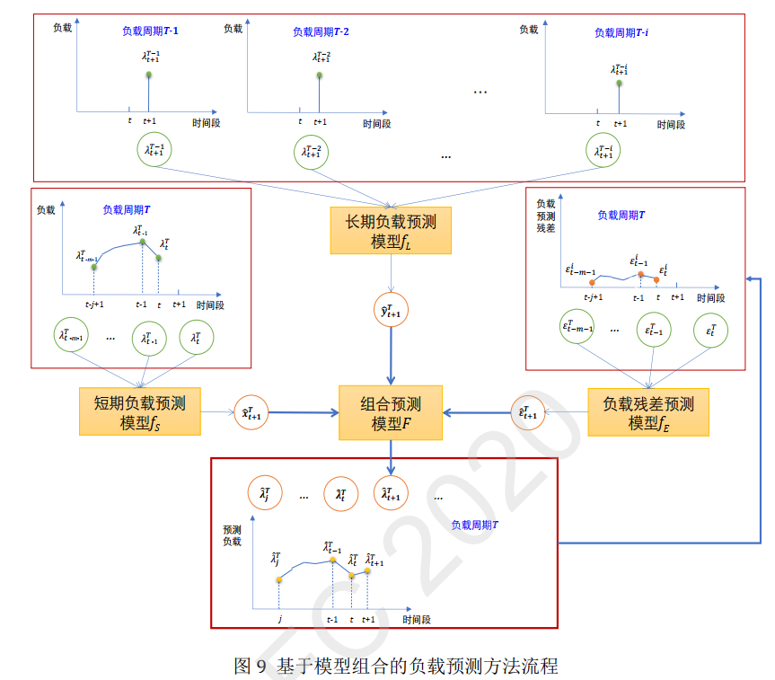

# 某篇文章

标签：论文阅读

目标：预测大规模服务系统的负载变化，并精确评估其云资源需求，在满足用户QoS的同时最小化资源供给

问题：
1. 缺乏服务需求与云资源消耗之间的定量化关系模型。计划使用排队论来进行建模
2. 云资源供应需求评估不精确导致运营成本高、服务质量低。综合约束关系，优化资源分配。
3. 负载预测不精确造成浪费。基于模型组合预测与时序差分强化学习方法结合的云资源动态伸缩方法，解决何时伸缩、如何伸缩的问题。

## 研究现状分析与总结

### 云资源服务质量评估

目标是建立服务质量需求与云资源消耗之间的定量化关系模型。参考文献：Survey on prediction models of applications for resources provisioning in cloud.

* 正向评估：输入是一个服务极其服务质量约束，输出是满足该质量约束的最小云资源消耗量。
* 逆向评估：输入是一个服务和相应的云资源，输出是服务在该云资源上的服务质量。

#### 正向评估

其中，正向评估方法的核心是采用各种预测模型来评估相应云资源的消耗：
1. Using ELM techniques to predict data center VM requests，结合K均值聚类和超限学习机的预测模型，可以预测数据中心未来虚拟的请求数量
2. Virtual resource prediction in cloud environment: A Bayesian approach. 提出了一种预测虚拟资源需求的贝叶斯模型，在Amazon EC2和Google CE的场景下，利用负载跟踪技术实现。
3. Prediction mechanisms for monitoring state of cloud resources using Markov chain model，基于连续时间马尔科夫链和离散时间马尔科夫链来实时监控移动网格资源。
4. A learning automata-based ensemble resource usage prediction algorithm for cloud computing environment，提出基于集成学习的云资源消耗预测方法，采用学习自动机来确定单个模型的权重。
5. An Intelligent Swarm Based Prediction Approach for Predicting Cloud Computing User Resource Needs，基于群体智能的云资源消耗预测方法，比贝叶斯模型和神经网络模型更加准确地预测云消费者在CPU、内存和磁盘存储利用率等方面的资源需求。

问题：云资源是多维的，不同维度之间还存在着一定的关联关系，因此准确率较低。此外，采用正向评估方法的代价较高，很难满足服务提供商对云资源供应的实际评估需求。

#### 逆向评估

一般采用测试、模拟仿真和机器学习等方法来构建服务质量预测模型。

1. Performance prediction of cloud applications through benchmarking and simulation，提出基于基准测试和模拟的方法，通过mOSAIC框架预测所开发的云应用在相应负载下的服务质量。
2. Modeling and performance analysis of cloudlet in Mobile cloud computing，对移动云计算环境下资源密集型操作提出了一种性能分析模型，分析了请求拒绝概率和平均响应延迟的使用因素，并使用SHAPPE软件包对模型进行了求解和验证。
3. Predicting cloud performance for HPC applications before deployment，针对高性能集群HPC应用系统，提出了一种基于机器学习的方法，用于预测应用程序在云中部署前的运行性能。
4. IoTDeM:An IoT Big Data-oriented MapReduce performance prediction extended model in multiple edge clouds，针对物联网环境的大数据应用，提出面向MapReduce任务执行时间预测模型，针对Hadoop2的历史作业执行记录采用局部线性回归技术
5. Quantitative quality estimation of cloud-based streaming services，针对流媒体云服务提出一种基于排队模型的服务质量仿真模拟方法。
6. Enterprise applications cloud rightsizing through a joint becnmarking and optimization approach，针对企业应用向云中迁移，提出一种组合评估方法和一组工具集，三个阶段：基准测试、性能分析和分类、评估和优化，目的是确定最佳的部署模式。

### 云资源优化分配

指当服务系统向公有云环境迁移时，服务提供商根据系统的负载需求以及云资源服务质量评估模型，制定**最优的云资源供应方案**。
目标：在满足服务质量约束的条件下，最小化云资源的租用成本。（ROAR: A QoS-oriented modeling framework for automated cloud resource allocation and optimization）

#### 云资源优化分配方法框架

1. ROAR: A QoS-oriented modeling framework for automated cloud resource allocation and optimization，设计了一个面向云资源优化分配与推荐的系统ROAR，通过ROAR可以支持云资源优化分配过程的自动化。采用特定领域语言来描述服务系统的配置，基于模型驱动的云资源优化引擎可以支持服务系统向云中的自动部署。
2. 面向云际计算的自动对等协作环境：提出了云际计算，以云服务提供者之间的开放协作为基础，方便开发者通过“软件定义”的方式来定制云服务
3. Agent-Based Approaches for Intelligent Intercloud Resource Allocation，提出了基于代理的智能化云际资源分配方法框架，通过构建代理来支持发现、匹配、选择、协商和调度云际资源。
4. Self-adaptive resource allocation for cloud-based software services based on iterative QoS prediction model，提出了一个基于迭代QoS预测模型的自适应云资源分配框架，采用粒子群君侧方法进行在线云资源优化分配。
5. A hierarhical structure for optimal resource allocation in geographically distributed clouds，提出了一种分层次的云资源分配方法，目标是在分布式的公有云环境中选择最优的云资源以满足用户的夺目比较傲服务质量需求。

#### 云资源优化分配建模及求解算法

1. Allocating resources for customizable multi-tenant applications in clouds using dynamic feature placement，借鉴软件产品线的思想，采用特征模型来描述服务之间的关系，提出一种基于动态特征放置的云资源优化分配模型，并采用整数规划和启发式算法对问题进行求解
2. Cost Optimization Oriented Dynamic Resource Allocation for Service-based System in the cloud environment，将云环境下服务系统的动态资源分配问题转换为了服务选择问题，提出了一种面向成本的动态资源分配模型，并采用遗传算法求解。
3. Optimizing Cloud-Service Performance: Efficient Resource Provisioning via Optimal Workload Allocation，采用随机租户框架来建模用户的服务请求，基于该框架提出了一种基于最大最小负载分解的云资源分配算法，其目标是优化云服务的性能。（云资源优化分配的一个主要目标是建立服务与云资源之间的部署关系）
4. 云环境中面向服务软件的演化部署优化方法，提出了一种面向服务的软件优化部署方法，该方法以提高软件的运行性能和降低运行成本为目标构建问题模型，设计了一种基于遗传算法的MGA-DO算法对其进行求解。
5. Adaptive large neighborhood search heuristics for multi-tier service deployment problems in clouds，针对基于三层架构的服务系统，提出一种基于自适应变领域搜索算法的服务优化部署，并采用混合整数规划方法修复不可行解。
6. Service deployment and scheduling for improving performance of composite cloud services，提出了一种基于负载感知的服务部署方法，有效提高云环境中组合服务的性能。

### 云资源动态伸缩

指服务系统被部署到公有云环境中，云资源供应方能按照终端用户负载的变化而动态调整。在负载增大时，租用更多的云资源来保障服务的质量；当负载下降时，能释放一定数量的云资源以降低运营成本。

预测方法可以分为两类：基于统计的方法和基于机器学习的方法。

* 基于统计的方法：根据过去的时间序列数据来预测未来可能的数据，包括AR、MA、ES、ARMA、ARIMA等。AME-WPC: Advanced model for efficient workload prediction in the cloud）
* 基于机器学习的预测方法：根据预测对象以及其他各种影响预测目标的因素来预测未来可能的数据，包括支持向量机（Virtual machine migration triggering using application workload prediction）、人工神经网络（workload prediction in cloud using artificial neural network and adaptive differential evolution）、聚类分析方法（Integrating Clustering and Learning for Improved Workload Prediction in the Cloud）

* 垂直伸缩：A residue-based approach for resource provisioning by horizontal scaling across heterogeneous clouds.
* 水平伸缩：Load Predicion-based automatic scaling cloud computing.

Cost-aware scalability of applications in public clouds.开发了一个成本感知的可伸缩控制器，通过该控制器来帮助云提供商分析成本与云资源消耗之间的关系。
Economics-driven resource scalability on the cloud，从规模经济学的角度出发，指导决策云资源的伸缩策略。

## 研究内容

1. 基于虚拟数据中心的大规模服务系统云资源供应建模。研究云资源供应建模方法，提出云资源供应模型。
2. 基于排队论的云资源服务质量评估模型与方法，从服务层次上刻画云资源消耗的本质特征。建立模型，输入响应时间、可靠性等指标，建立与用户负载、处理能力和容量之间的定量化关系。
3. 成本驱动与服务质量感知的云资源优化分配方法，对每个服务构建，首先计算满足服务质量约束条件下每个虚拟单元的最大负载能力，然后采用遗传算法等智能优化方法来获取成本最低的云资源供应方案。
4. 基于负载预测与强化学习的云资源动态伸缩方法。目的是通过负载预测的结果和强化学习的决策提前调整云资源供应方案，避免云资源供应不足和浪费情况的发生。

### 基于虚拟数据中心的大规模服务系统云资源供应建模研究

建立了一个云资源供应模型，由上至下可以分为三个层次：服务需求层、云资源供应层和云资源整合层。

* 服务需求层：对服务系统的业务流程、负载分布特征以及服务质量约束的描述。
* 云资源供应层：对虚拟数据中心，即云资源供应方案的描述
* 云资源整合层：对公有云环境下由不同云提供商所提供的云资源的统一描述、分类和聚合

* 在服务需求层，提出基于行为模式图的服务需求建模方法
* 在云资源整合层看，提出基于虚拟单元的云资源整合建模方法
* 在云资源供应层，本项目提出基于服务构件的虚拟数据中心建模方法。

**服务行为模式图**SBPG，可能可以被用来描述多服务环境下的依赖关系。不过其转移更类似于状态机，pij表示得到是服务Si到服务Sj的转移概率，其转移概率根据业务规则来设定。实际计算是在运行阶段通过分析用户日志得到。

云资源整合层，借鉴Web服务描述语言WSDL，对不同云提供商所提供的虚拟单元进行统一描述，采用云代理的方式从虚拟资源池中统一分配。

### 基于排队论的云资源服务质量评估模型与方法研究

云资源服务质量评估，目标是建立服务质量需求与云资源消耗之间的定量化关系模型。

* 处理能力：单位时间内服务节点完成用户服务请求的平均数量。
* 容量：服务节点所能接受的最大并发服务请求数量
* 服务节点：一个部署服务的虚拟单元
可以采用性能度量（benchmark）的方式来测得每个服务的各项指标，并计算均值。

### 基于负载预测与强化学习的云资源动态伸缩方法研究

将云资源伸缩策略看作是一个马尔科夫决策过程，使用强化学习方法。

#### 基于模型组合的负载预测方法

负载时段和负载周期：负载指单位时间内服务请求到达率

按照负载的采集周期将连续时间离散化为时间片段，每个时间片段称为一个负载片段。

负载周期可以定义为一个负载时段序列。

问题：目前提出的预测方法只考虑与当前时间段相近的负载数据，而忽略了不同负载周期在统一时段的历史负载信号。

做法：借鉴集成学习方法，提出基于模型组合的负载预测方法，为每个服务构件建立一个组合预测模型，集成短期预测模型和长期预测模型，投票生成组合预测值。为了降低预测的白噪声，将组合预测值与真实值再进行一次残差预测来修正误差。

1. 短期负载预测模型：即用同一个周期内的相邻数据预测，采用ARMA
2. 长期负载预测模型：用不同周期的同一时段来进行预测，采用基于成长曲线模型的预测方法。
3. 负载残差预测模型：预测对象为真实值与预测值的差，采用BP神经网络
4. 组合预测模型：综合上述三个模型进行预测，采用投票方式，最终预测值为短期负载和长期负载的加权值加上残差。

#### 基于强化学习的云资源动态伸缩优化决策

目标：确认每个服务构件在每个状态下的最优动作，从而最大化累积奖赏。

问题：当前时刻的状态转移概率和奖赏函数的取值是不确定的，需要根据当前时段的负载预测结果来动态判定。（免模型学习，主要有蒙特卡罗方法和时序差分方法）

虚拟单元vujP05、服务构件c的定义

* 状态定义：服务C在不同虚拟单元的服务数量。
* 动作定义：调整各虚拟单元的数量。

奖励函数定义为云资源的调整成本，保证服务质量条件下云资源增加的成本越高，奖赏越低。

根据负载预测计算即时奖赏（与书博师兄的想法类似）